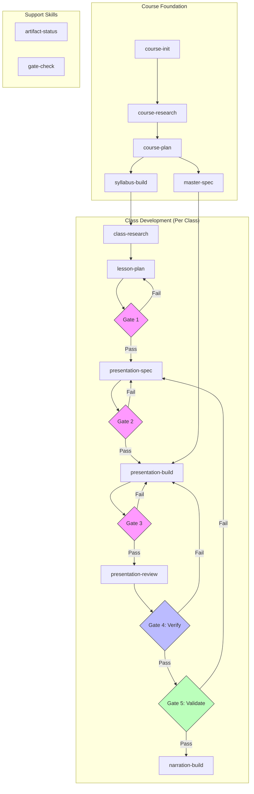

# RPIV Curriculum Development Architecture

## Overview

A systematic approach to building educational course content using Research, Plan, Implement, Verify/Validate methodology. Designed for Astro-based presentation courses with AI-generated voice narration.

---

## Workflow Diagram



---

## Skill Catalog

### Meta-Skills (Foundation Building)

| Skill | Type | Purpose | Primary Output |
|-------|------|---------|----------------|
| skill-builder | meta | Create new skills with proper structure | `.claude/skills/{name}/SKILL.md` |
| skill-architect | meta | Design skill sets for workflows | `workflow-diagram.md` |
| rpiv-workflow | orchestrator | Guide through complete RPIV process | (guidance only) |

### Course-Level Skills

| Skill | Type | Purpose | Primary Output |
|-------|------|---------|----------------|
| course-init | implement | Scaffold Astro project from template | Project structure |
| course-research | research | Research pedagogical approaches | `curriculum-design-research.md` |
| course-plan | plan | Define teaching philosophy | `course-plan.md` |
| syllabus-build | plan | Create session schedule | `SYLLABUS.md` |
| master-spec | plan | Establish design system | `master-presentation-spec.md` |

### Class-Level Skills

| Skill | Type | Purpose | Primary Output |
|-------|------|---------|----------------|
| class-research | research | Deep research on topic | `research-{topic}.md` |
| lesson-plan | plan | Plan instruction for topic | `lesson-plan-{topic}.md` |
| presentation-spec | plan | Specify slides for topic | `presentation-spec-{topic}.md` |
| presentation-build | implement | Build Astro presentation | `presentation.astro` |
| presentation-review | verify | Validate and verify presentation | `reviewlog.md` |
| narration-build | implement | Generate voice narration | `script.md` + `audio/*.mp3` |

### Support Skills

| Skill | Type | Purpose | Primary Output |
|-------|------|---------|----------------|
| artifact-status | verify | Check artifact completeness | Status report |
| gate-check | verify | Run validation gates | Gate results |

---

## Dependency Matrix

### Course-Level Dependencies

| Skill | Depends On | Blocks | Gate |
|-------|------------|--------|------|
| course-init | - | course-research | - |
| course-research | course-init | course-plan | - |
| course-plan | course-research | syllabus-build, class-* | - |
| syllabus-build | course-plan | class-research | - |
| master-spec | course-plan | presentation-build | - |

### Class-Level Dependencies

| Skill | Depends On | Blocks | Gate |
|-------|------------|--------|------|
| class-research | syllabus-build | lesson-plan | - |
| lesson-plan | class-research, course-plan | presentation-spec | Gate 1 |
| presentation-spec | lesson-plan | presentation-build | Gate 2 |
| presentation-build | presentation-spec, master-spec | presentation-review | Gate 3 |
| presentation-review | presentation-build | narration-build | Gates 4-5 |
| narration-build | presentation-review | - | - |

---

## Gate Definitions

### Gate 1: Lesson Plan Alignment

**Trigger**: After `lesson-plan`, before `presentation-spec`

**Validation Checklist**:
- [ ] Learning objectives trace directly to course plan principles
- [ ] Each objective is measurable and achievable in class time
- [ ] Activities align with each stated objective
- [ ] Assessment methods defined for each objective
- [ ] Time allocations sum correctly and are realistic
- [ ] Prerequisites from previous classes acknowledged

**Pass Criteria**: All checks pass

**On Failure**:
- Return to `lesson-plan` skill
- Provide specific feedback on which objectives don't trace
- Suggest concrete fixes

### Gate 2: Spec Achievement

**Trigger**: After `presentation-spec`, before `presentation-build`

**Validation Checklist**:
- [ ] Every learning objective has at least one supporting slide
- [ ] Complex concepts have D3 visualization specs
- [ ] Interaction points (questions, activities) are marked
- [ ] Slide flow supports logical learning progression
- [ ] Time estimates per slide sum to class duration
- [ ] All expert content sources cited

**Pass Criteria**: All checks pass

**On Failure**:
- Return to `presentation-spec` skill
- Identify gaps between objectives and slides
- Suggest additional slides or visualizations

### Gate 3: Implementation Match

**Trigger**: After `presentation-build`, before `presentation-review`

**Validation Checklist**:
- [ ] All slides from spec are implemented
- [ ] D3 visualizations match spec descriptions
- [ ] Font sizes meet minimums (1.25rem for labels, 1.5rem for body)
- [ ] Navigation keyboard shortcuts work (T, A, S, F, arrows)
- [ ] Responsive layout displays correctly
- [ ] All images and assets load
- [ ] No console errors

**Pass Criteria**: All checks pass

**On Failure**:
- Return to `presentation-build` skill
- List specific implementation gaps
- Provide code fixes for common issues

### Gate 4: Verification

**Trigger**: After `presentation-review` (first pass)

**Question**: "Did we build the thing right?"

**Validation Checklist**:
- [ ] Code follows project conventions
- [ ] Accessibility requirements met (contrast, alt text, keyboard nav)
- [ ] Performance acceptable (no render blocking, optimized assets)
- [ ] No JavaScript errors in console
- [ ] Cross-browser compatible (Chrome, Firefox, Safari)
- [ ] Zoom-friendly for remote viewing

**Pass Criteria**: All checks pass

**On Failure**:
- Fix CODE, not spec
- Return to `presentation-build` with specific code fixes
- Re-run Gate 4

### Gate 5: Validation

**Trigger**: After Gate 4 passes

**Question**: "Did we build the right thing?"

**Validation Checklist**:
- [ ] A subject expert would find content accurate
- [ ] Explanations are clear for target audience level
- [ ] Visualizations effectively communicate concepts
- [ ] Pacing allows for comprehension
- [ ] Examples are relevant and helpful
- [ ] Teaching objectives are achievable with this content

**Pass Criteria**: All checks pass

**On Failure**:
- Fix SPEC first (this is a design problem)
- Then update implementation to match revised spec
- Re-run Gates 3, 4, and 5

---

## Configuration Points

From `rpiv-config.json`:

| Config Path | Purpose | Default |
|-------------|---------|---------|
| `framework` | Build framework | `"astro"` |
| `narration.provider` | Voice synthesis | `"elevenlabs"` |
| `narration.voiceId` | Default voice | `"configurable"` |
| `research.requireMinSources` | Min research sources | `2` |
| `research.requireMinMisconceptions` | Min misconceptions | `3` |
| `validation.strictMode` | Enforce all gates | `true` |
| `validation.minFontSize` | Minimum font size | `"1rem"` |
| `astro.componentPath` | Component location | `"src/components/presentation"` |

---

## Artifact Paths

### Course-Level Artifacts

| Artifact | Path | Created By |
|----------|------|------------|
| Research document | `curriculum-design-research.md` | course-research |
| Course philosophy | `course-plan.md` | course-plan |
| Session schedule | `SYLLABUS.md` | syllabus-build |
| Design system | `master-presentation-spec.md` | master-spec |
| RPIV config | `.claude/rpiv-config.json` | course-init |

### Class-Level Artifacts

| Artifact | Path Pattern | Created By |
|----------|--------------|------------|
| Topic research | `research/research-{topic}.md` | class-research |
| Lesson plan | `src/pages/class-{n}-{topic}/lesson-plan-{topic}.md` | lesson-plan |
| Presentation spec | `src/pages/class-{n}-{topic}/presentation-spec-{topic}.md` | presentation-spec |
| Presentation | `src/pages/class-{n}-{topic}/presentation.astro` | presentation-build |
| Review log | `src/pages/class-{n}-{topic}/reviewlog.md` | presentation-review |
| Narration script | `src/pages/class-{n}-{topic}/script.md` | narration-build |
| Audio files | `public/audio/class-{n}/*.mp3` | narration-build |

---

## Usage Patterns

### New Course from Scratch

```bash
# Foundation (do once)
/course-init
/course-research
/course-plan
/syllabus-build
/master-spec

# Per class (repeat)
/class-research {topic}
/lesson-plan {topic}
/presentation-spec {topic}
/presentation-build {topic}
/presentation-review {topic}
/narration-build {topic}  # optional
```

### Add Single Class to Existing Course

```bash
/artifact-status                    # Verify foundation exists
/class-research {new-topic}
/lesson-plan {new-topic}
/presentation-spec {new-topic}
/presentation-build {new-topic}
/presentation-review {new-topic}
```

### Check Progress and Resume

```bash
/artifact-status                    # See what exists
/rpiv-workflow                      # Get guidance on next steps
```

### Validation Pass

```bash
/gate-check all                     # Run all gates
/gate-check class-3                 # Run gates for specific class
/presentation-review {topic}        # Full V&V cycle
```

---

## V&V Decision Tree

When a problem is found:

```
Is it a code quality issue?
├── YES → Gate 4 (Verification) → Fix CODE
└── NO → Is the implementation missing something from spec?
         ├── YES → Gate 3 (Implementation Match) → Fix CODE
         └── NO → Does the spec fail to support objectives?
                  ├── YES → Gate 5 (Validation) → Fix SPEC, then CODE
                  └── NO → Does the lesson plan align with course?
                           ├── NO → Gate 1 → Fix LESSON PLAN
                           └── YES → Gate 2 → Fix SPEC
```

Key principle: **Always fix at the highest appropriate level.** Don't patch code when the spec is wrong.
